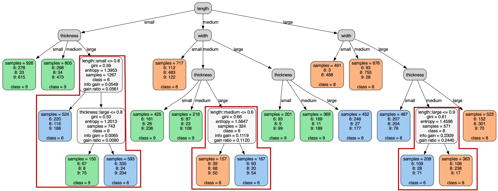

# Tree-Based Leakage Inspection and Control in Concept Bottleneck Models    
### Angelos Ragkousis, Sonali Parbhoo


## Table of Contents
- [Abstract](#introduction)
- [Installation](#installation)
- [Usage](#usage)
- [Example](#example)
- [License](#license)

## Abstract
As AI models grow larger, the demand for accountability and interpretability has become in- creasingly critical for understanding their decision-making processes. Concept Bottleneck Models (CBMs) have gained attention for enhancing interpretability by mapping inputs to intermediate con- cepts before making final predictions. However, CBMs often suffer from information leakage, where additional input data, not captured by the concepts, is used to improve task performance, complicat- ing the interpretation of downstream predictions. In this paper, we introduce a novel approach for training both joint and sequential CBMs that allows us to identify and control leakage using decision trees. Our method quantifies leakage by comparing the decision paths of hard CBMs with their soft, leaky counterparts. Specifically, we show that soft leaky CBMs extend the decision paths of hard CBMs, particularly in cases where concept information is incomplete. Using this insight, we develop a technique to better inspect and manage leakage, isolating the subsets of data most affected by this. Through synthetic and real-world experiments, we demonstrate that controlling leakage in this way not only improves task accuracy but also yields more informative and transparent explanations.

## Installation
Steps to set up the environment and install dependencies:
1. Clone the repository:
    ```bash
    git clone https://github.com/ai4ai-lab/mixed-cbm-with-trees.git
    cd your-repo
    ```
2. Create and activate a virtual environment:
    ```bash
    python -m venv env
    source env/bin/activate  # On Windows, use `env\Scripts\activate`
    ```
3. Install dependencies:
    ```bash
    pip install -r requirements.txt
    ```

## Usage
#### To run an experiment on Morpho-MNIST
- First, train the hard cbm (global tree). Change the hyperparameters in the config file if needed.
    ```bash
    python train.py -c config_files/mnist_hard_cbm.json
    ```
  By default, the logs and the global tree will be saved in the `saved/log/hard_cbm_mnist/your_date` directory, where "your_date" is replaced with your current date and time. Accordingly, the trained model will be saved in the `saved/models/hard_cbm_mnist/your_date` directory.
<br/><br/>
- Then, train the MCBM-Seq algorithm on the Morpho-MNIST dataset using the following configuration file. Replace the relative path
of the trained concept predictor with the one from the previous step. Change the 'min_samples_leaf' hyperparameter for experimentation.
    ```bash
    python train.py -c config_files/mnist_mcbm_seq.json --pretrained_concept_predictor saved/models/hard_cbm_mnist/your_date/model_best.pth
    ```
  By default, the logs, the global tree, the merged tree and all individual decision paths will be saved in the `saved/log/mcbm_seq_mnist/your_date` directory. 

## Example
The MCBM-Seq algorithm for a reduced Morpho-MNIST dataset with digits 6, 8 and 9 and concepts “length”, “thickness” and “width” is shown below. The final tree merged the sub-trees is given. If a sub-tree is found, it replaces the leaf node of the hard CBM and is highlighted in a red box. The remaining leaf nodes are unaffected by leakage. This architecture allows us to both inspect and restrict leakage only to subsets with missing concept information.



## License
Project license:
This project is licensed under the MIT License - see the [LICENSE](LICENSE) file for details.
